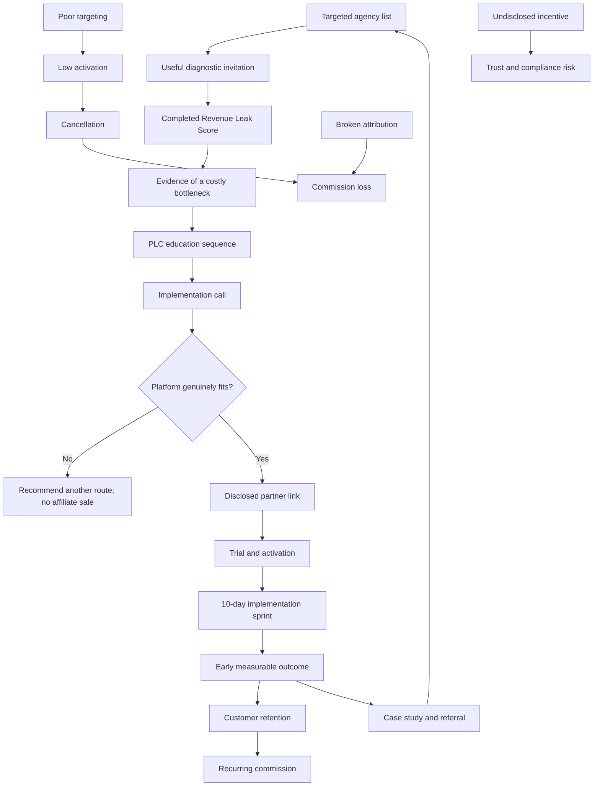

# Strategy: QA-Led Partner Revenue

## Strategic decision

Start with **HighLevel for agencies** and keep **Thinkific for education businesses** as the second vertical.

The winning unit is not an affiliate click. It is:

`diagnosed problem → trusted education → implementation → retained customer → verified commission`

## Causal graph



## Why PLF fits

A partner platform is difficult to sell directly because the buyer sees software complexity, migration risk and another monthly bill. Product Launch Formula changes the perceived sequence:

1. **Opportunity:** show the revenue leak, not the software.
2. **Transformation:** show the future operating system.
3. **Ownership:** let the prospect diagnose their own process.
4. **Offer:** provide implementation plus the right platform.

## Primary ideal customer profile

- owner-led agency or consultancy;
- 3–30 staff or contractors;
- 50–1,000 monthly leads;
- average customer value above $1,000;
- fragmented CRM, inbox and calendar workflow;
- at least one person responsible for sales operations;
- willing to measure response, bookings, attendance and payments.

### Disqualifiers

- no consistent lead flow;
- offer has not sold yet;
- expects guaranteed revenue;
- wants unsolicited bulk messaging or deceptive scarcity;
- cannot legally contact the proposed audience;
- refuses basic measurement and process ownership.

## Offer ladder

### Free — Revenue Leak Score

Twelve-question diagnostic, top three risks and a 10-day action outline.

### Entry — Revenue Trace Workshop

Suggested validation price: **$250–$500**.

Deliverable: 90-minute workshop, current-state map, baseline and prioritised backlog.

### Core — AI Agency Revenue OS Sprint

Suggested validation price: **$1,500–$3,000** depending on scope.

One revenue path, not the whole company. The sprint must end with tested transitions and observable metrics.

### Recurring — Revenue QA

Suggested validation price: **$300–$1,000/month**.

Monthly regression tests, attribution reconciliation, experiment review and optimisation.

Pricing is a hypothesis. Validate willingness to pay before standardising it.

## Unit economics model

For a HighLevel customer on a $297 plan, the official example implies approximately **$118.80/month** at a 40% rate before any adjustments, refunds or policy changes.

A simple cohort model:

```text
new_active_customers_per_month = 3
monthly_commission_per_customer = 118.80
monthly_logo_churn_assumption = 5%
```

Approximate active referred accounts after 12 monthly cohorts:

```text
3 × (1 + .95 + .95² + ... + .95¹¹) ≈ 27.6 accounts
```

Approximate month-12 gross commission:

```text
27.6 × $118.80 ≈ $3,279/month
```

This is scenario modelling, not a forecast. It excludes tax, refunds, failed attribution, changes in plan mix and program terms.

## North-star and guardrails

### North-star

**Verified retained partner revenue per qualified implementation cohort.**

### Funnel KPIs

- targeted accounts contacted;
- positive reply rate;
- diagnostic completion rate;
- qualified-call rate;
- workshop close rate;
- implementation close rate;
- partner-link click rate;
- trial activation rate;
- paid conversion rate;
- 30/90/180-day customer retention;
- approved and paid commission.

### Quality guardrails

- complaint and unsubscribe rate;
- number of recommendations rejected due to poor fit;
- automation incident count;
- attribution mismatch rate;
- refund and cancellation rate;
- percentage of partner CTAs with visible disclosure;
- percentage of claims backed by a source or customer evidence.

## 30-day execution

### Week 1 — Foundation

- submit partner applications;
- complete payout and tax onboarding after approval;
- replace placeholder contact flow with a real webhook;
- create a 100-account ICP list;
- run five customer interviews.

### Week 2 — Prelaunch

- publish the diagnostic;
- invite the first 30 accounts manually;
- record PLC 1 and PLC 2;
- run three free Revenue Trace Workshops;
- document objections verbatim.

### Week 3 — Launch

- release PLC 3;
- host the implementation webinar;
- open five pilot slots with real capacity constraints;
- use explicit partner disclosure wherever a platform is linked.

### Week 4 — Evidence

- onboard up to two pilots;
- instrument source, response, booking and payment events;
- run regression and attribution tests;
- publish a case study only with permission and honest caveats;
- decide whether to scale, revise or stop.

## Kill criteria

Pause the campaign when any of these are true:

- fewer than 5 of the first 30 targeted accounts recognise the problem;
- no qualified buyer accepts a paid workshop after 10 discovery calls;
- activation requires more delivery effort than the service margin supports;
- the platform is a poor fit for more than half of qualified prospects;
- attribution cannot be reliably tested;
- complaint or trust signals deteriorate.
